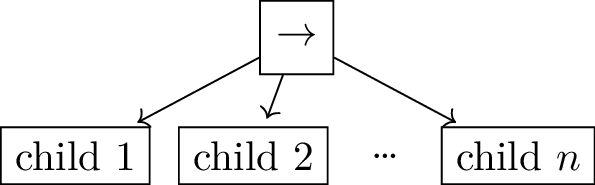
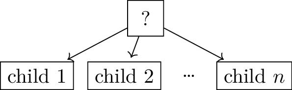
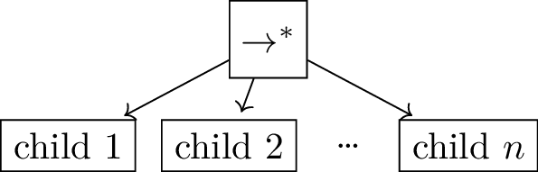
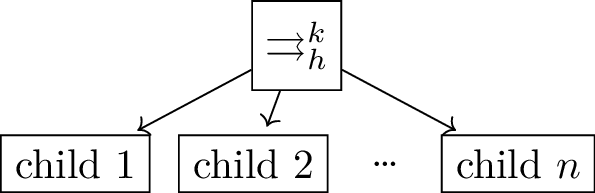
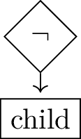
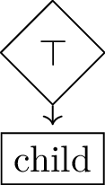
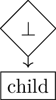

REP: 2018
Title: Behavior Trees
Author: Enrico Ghiorzi <enrico.ghiorzi@edu.unige.it>, Christian Henkel <christian.henkel2@de.bosch.com>
Status: Proposed
Type: Informational
Content-Type: text/x-rst
Created: 29-Jan-2024
Post-History: 

Behavior Trees
==============

A *behavior tree* is a directed rooted tree having *control flow* and
*decorator* nodes as internal nodes, and *execution* nodes as leaves
[colledanchise2018]_.

A behavior tree executes when it is *ticked* until it provides a
*response*, which is a message that contains one of the following
states: *Success*, *Failure*, or *Running*. The execution flow is the
following:

-  The execution starts by ticking the root node;

-  Control flow nodes activate when ticked and can propagate the tick
   to their children;

-  Execution nodes activate when ticked and respond *Success*,
   *Failure*, or *Running*;

-  Control flow nodes receive responses from their children and decide
   what to respond to their parents;

-  Finally, a response reaches the root node, terminating the execution.

Moreover, unlike behavior trees as used in, e.g., videogame development,
behavior trees in robotics need to handle concurrency.
For this reason, we need to introduce a *halt* signal to interrupt
the executions of conflicting concurrent actions.

Graph formulation
-----------------

The behavior tree can be defined as a graph :math:`BT = (V, E)`, where
:math:`V` is the set of nodes and :math:`E` is the set of edges.

Nodes can be of three types: *control flow nodes*, *decorator nodes* and
*execution nodes*. :math:`V_{cf} \subseteq V` is the set of control flow
nodes, :math:`V_{de} \subseteq V` is the set of decorator nodes, and
:math:`V_{ex} \subseteq V` is the set of execution nodes.

Edges are directed and can connect control flow nodes or decorator nodes
to other control flow nodes, decorator nodes, or to execution nodes:
:math:`(u, v) \in E \implies u \in (V_{cf} \cup V_{de}) \land v \in (V_{cf} \cup V_{de} \cup V_{ex}) \setminus \{root\}`.
It is the only node that does not have any incoming edge. Note also that
execution nodes do not have outgoing edges.

In behavior trees, the outgoing edges of a control flow node are
ordered. We denote the set of outgoing edges of a node :math:`u` as
:math:`E_u = \{(u, v) \in E \mid v \in V\}`. The order is given by a
precedence relation :math:`\prec_u: E_u \times E_u`. We say that
:math:`(u, v) \prec_u (u, w)` if :math:`v` is executed before :math:`w`.
In graphical syntax, :math:`v` is drawn on the left of :math:`w`.

Decorator nodes have only one outgoing edge:
:math:`u \in V_{de} \implies |E_u| = 1`. Therefore they do not require a
precedence relation.

.. _ssec:bt_syntax:

Graphical syntax
----------------

Execution Nodes
~~~~~~~~~~~~~~~

There are two types of execution nodes: *action nodes* and *condition
nodes*. All execution nodes are decorated with a label that describes
what the node does.

An action node is thought of as performing an action that can take an
indefinite amount of time to complete.
Until the action is completed, the node will return *Running* when ticked.
When the action is completed, the node will return *Success* or *Failure*.
We denote ticking of a node :math:`u` as :math:`u.tick()`.

Additionally, an action node can be halted, which means that the action
it is performing is interrupted. 
This is done by calling the halt function of the node: :math:`u.halt()`.

A condition node is thought of as instantaneously verifying a condition,
so it can return only *Success* or *Failure* when ticked, but not *Running*.

Control Flow Nodes
~~~~~~~~~~~~~~~~~~

We have the following types of control flow nodes:

-  *Reactive Sequence* and *Reactive Fallback*

-  *Sequence with Memory* and *Fallback with Memory*

-  *Parallel*

Beware that the nomenclature in the literature is inconsistent and might
not correspond to the one defined in this document. We present a
nomenclature comparison between this document,
[colledanchise2018]_, and [behavior_tree_cpp]_.

.. container::
   :name: tab:nomenclature

   .. table:: Nomenclature comparison

      +-----------------------+-----------------------+-----------------------+
      | [colledanchise2018]_  | [behavior_tree_cpp]_  | This document         |
      +=======================+=======================+=======================+
      | Sequence              | Reactive Sequence     | Reactive Sequence     |
      +-----------------------+-----------------------+-----------------------+
      | Sequence with Memory  | Sequence              | Sequence with Memory  |
      +-----------------------+-----------------------+-----------------------+
      | *N.A.*                | Sequence with Memory  | *N.A.*                |
      +-----------------------+-----------------------+-----------------------+
      | Fallback              | Reactive Fallback     | Reactive Fallback     |
      +-----------------------+-----------------------+-----------------------+
      | Fallback with Memory  | Fallback              | Fallback with Memory  |
      +-----------------------+-----------------------+-----------------------+
      | *N.A.*                | Fallback with Memory  | *N.A.*                |
      +-----------------------+-----------------------+-----------------------+
      | Parallel              | *N.A.*                | Reactive Parallel     |
      +-----------------------+-----------------------+-----------------------+
      | *N.A.*                | Parallel              | Parallel whith Memory |
      +-----------------------+-----------------------+-----------------------+

The *Reactive Sequence* node executes, which corresponds to routing the
ticks to its children from the left until it finds a child that returns
either Failure or Running, then it returns Failure or Running
accordingly to its own parent. It returns Success if and only if all its
children return Success. Note that when a child returns Running or
Failure, the Reactive Sequence node does not route the ticks to the next
child (if any). The symbol of the Reactive Sequence node is a box
containing the label  “:math:`\rightarrow`”, shown below.

::

	for i ← 1 to n do
		childResponse ← child(i).tick()
		if childResponse = Running | Failure then
			for j ← i+1 to n do
				child(j).halt()
			return childResponse
	return Success

.. WARN: this is the behavior of BehaviorTree.cpp 3.8.5 but it changes in 3.8.6

.. Generally
.. ~~~~~~~~~

.. The behavior of reactive nodes is guaranteed to be sound
.. (as in, no more than a single action node can be running at a time)
.. only if at most one child of the node contains action nodes.

.. An example of unsound behavior is given by a reactive sequence or fallback
.. with two action leaves as children: if on the first tick the first action
.. responds Success and the second Running, then on the second tick
.. the first action will be ticked if it is Running, then the second action
.. will still be Running, until it is halted.

.. This specification does not specify how to deal with this issue
.. and leaves it to the implementation instead.

The *Reactive Fallback* node executes, which corresponds to routing the
ticks to its children from the left until it finds a child that
returns either Success or Running, then it returns Success or Running
accordingly to its own parent. It returns Failure if and only if all
its children return Failure. Note that when a child returns Running or
Success, the Reactive Fallback node does not route the ticks to the
next child (if any). The symbol of the the Reactive Fallback node is a 
box containing the label “?”, shown below.

::

	for i ← 1 to n do
		childResponse ← child(i).tick()
		if childResponse = Running | Success then
			for j ← i+1 to n do
				child(j).halt()
			return childResponse
	return Failure

.. WARN: this is the behavior of BehaviorTree.cpp 3.8.5 but it changes in 3.8.6

The *Sequence with Memory* node executes, which corresponds to routing
the ticks to its children from the left until it finds a child that
returns either Failure or Running, then it returns Failure or Running
accordingly to its own parent. Moreover, if a node returns Running, the
successive execution will restart from the same node. It returns Success
if and only if all its children return Success. Note that when a child
returns Running or Failure, the Sequence with Memory node does not route
the ticks to the next child (if any). The symbol of the Sequence
with Memory node is a box containing the label “:math:`\rightarrow^*`”
as shown below.

::

In the following pseudocode and the one for *Fallback with Memory*, the
function *toTickFromLastIteration* returns the value of the variable toTick
from the last iteration of this control flow node. If it is the first
iteration, it returns 1.

	toTick ← toTickFromLastIteration();
	for j ← toTick to n do
		response ← child(j).tick()
		if response != Success then
			return response
   toTick ← 1
	return Success

The *Fallback with Memory* node executes, which corresponds to routing
the ticks to its children from the left until it finds a child that
returns either Success or Running, then it returns Success or Running
accordingly to its own parent. Moreover, if a node returns Running, the
successive execution will restart from the same node. It returns Failure
if and only if all its children return Failure. Note that when a child
returns Running or Success, the Fallback with Memory node does not route
the ticks to the next child (if any). The symbol of the Fallback
with Memory node is a box containing the label “:math:`?^*`” as shown
below.

.. image:: rep-2018/fallback-memory.png
   :alt: Fallback with Memory Node

::

	toTick ← toTickFromLastIteration();
	for i ← 1 to n do
		if child(i).status() = Running then
			toTick ← i
			break
	for j ← toTick to n do
		response ← child(j).tick()
		if response != Failure then
			return response
   toTick ← 1
	return Failure

The *(Reactive) Parallel* node with success threshold :math:`k`
executes (with :math:`k \leq n`), which corresponds to
routing the ticks to all its children and it returns Success if at least
:math:`k` children return Success, it returns Failure if at least
:math:`n - k + 1` children return Failure, and it returns Running otherwise. The
symbol of the Parallel Sequence node with success threshold :math:`k`
is a box containing the label
“:math:`\rightrightarrows^{k}`”, shown below.

::

	successCount ← 0
	failureCount ← 0
	for i ← 1 to n do
		childResponse ← child(i).tick()
		if childResponse = Success
			successCount ← successCount + 1
		else if childResponse = Failure
			failureCount ← failureCount + 1
	if successCount >= k
		self.halt()
		return Success
	else if failureCount > n - k
		self.halt()
		return Failure
	else
		return Running
	
.. Do we want this too?
.. The *Parallel with Memory* node with success threshold :math:`k` and failure threshold
.. :math:`h` executes (with :math:`k+h-1 \leq n`), which corresponds to
.. routing the ticks to all its running children and it returns Success if at least
.. :math:`k` children return Success, it returns Failure if at least
.. :math:`h` children return Failure, and it returns Running otherwise. The
.. symbol of the Parallel Sequence node with success threshold :math:`k`
.. and failure threshold :math:`h` is a box containing the label
.. “:math:`\rightrightarrows^{k}_{h}`”, shown below.
	
.. 	successCount ← 0
.. 	failureCount ← 0
.. 	for i ← 1 to n do
.. 		if !skipList.contains(i)
.. 			childResponse(i) ← child(i).tick()
.. 		if childResponse(i) = Success
.. 			successCount ← successCount + 1
.. 			skipList.insert(i)
.. 			if successCount >= k
.. 				self.halt()
.. 				skipList.clear()
.. 				return Success
.. 		else if childResponse(i) = Failure
.. 			failureCount ← failureCount + 1
.. 			skipList.insert(i)
.. 			if failureCount > h || failureCount > n - k
.. 				self.halt()
.. 				skipList.clear()
.. 				return Failure
.. 	return Running

For every control flow node, the 'halt' function reroutes the halting signal
to all of its children:

	for child in self.children
		child.halt()
	
Decorator nodes
~~~~~~~~~~~~~~~

A Decorator node is a control flow node with a single child that
manipulates the return status of its child according to a user-defined
rule and also selectively ticks the child according to some predefined
rule.

The decorator nodes we consider are:

-  *Inverter* node

-  *Force Success* node

-  *Force Failure* node

The Inverter node ticks the child once and return Success if the
child failed or Failure if the child succeeded. If the child returns
Running, this node returns Running too.

::

   response ← child.tick()
   if response = Success then
       return Failure
   else if response = Failure then
       return Success
   else
       return Running

The Force Success node, if the child returns Running, returns Running
too. Otherwise, it returns always Success.

::

   if child.tick() = Running then
       return Running
   else
       return Success

The Force Failure node, if the child returns Running, returns Running
too. Otherwise, it returns always Failure.

::

   if child.tick() = Running then
       return Running
   else
       return Failure

.. _ssec:bt_xml:

References
----------

.. [colledanchise2018] 
   Colledanchise, Michele and Ögren, Petter;
   Behavior trees in robotics and AI: An introduction;
   2018

.. [behavior_tree_cpp] 
   BehaviorTree.CPP;
   Version 3.8;
   https://www.behaviortree.dev/
   
